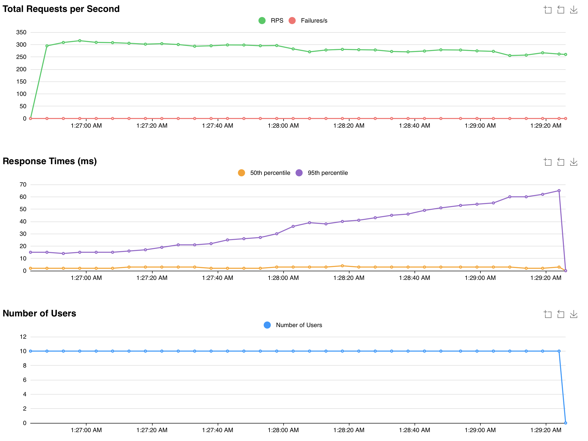

# Тестовое задание

## Тех. задание

```
https://github.com/avito-tech/tech-internship/tree/main/Tech%20Internships/Backend/Backend-trainee-assignment-autumn-2025
```

## Openapi спецификация

Посмотреть openapi спецификацию можно по адресу: `http://localhost:8080/docs`

## Инструкция

Запуск с помощью Makefile

-   `make run`

ИЛИ

-   Создать `.env`

```
cp .env.example .env
```

-   Запустить Docker

```
docker compose up
```

## Результаты нагрузочного теста

Locust Test

[SLI] Aggregate results

Requests: 47093 | Failures: 0

RPS: 259.90 | Success SLI: 100.00%

Latency ms -> min 0.4 | avg 6.9 | max 252.3 | p10 1.0 | p90 16.0




## Технологии

### Backend

-   FastAPI
-   Pydantic
-   TortoiseORM
-   Uvicorn

### База данных

-   PostgreSQL


